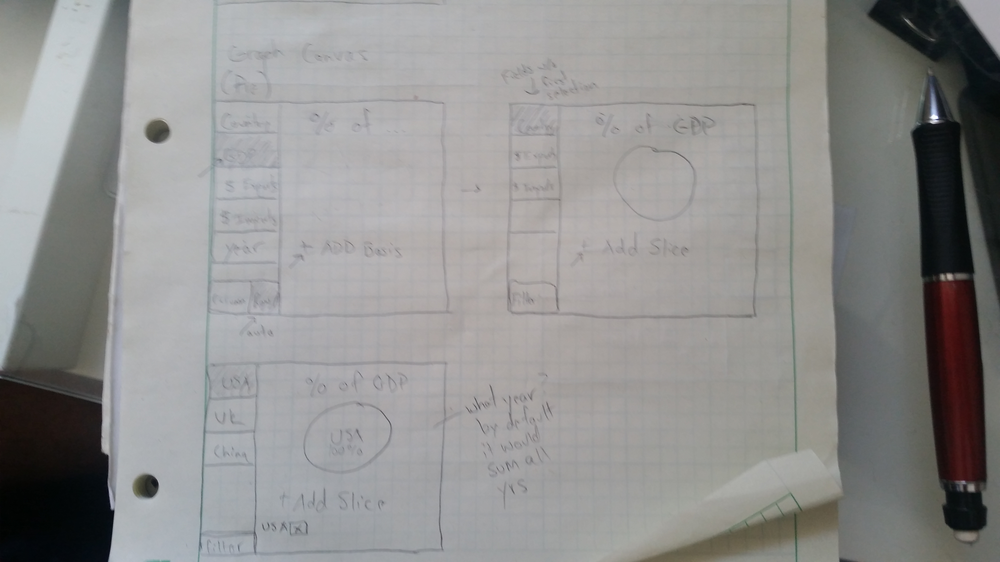

# July 5, 2016

For this week, I think the major concern is coming up with the flow of how to convert field selections into a graph. That is, how do you allow a person to work with the meta-structure of their data to create bounded graphs.

For this I have 2 drawings, one that shows a potential flow for selecting fields and putting them into a pie chart. (below)

And the second one shows a flow of binding axes and choosing a line for a line graph. (below)

I'm hoping Bosmon and I can come up with good solutions to this during this meeting so that by next week I can apply one of these flows into making a manipulatable chart.